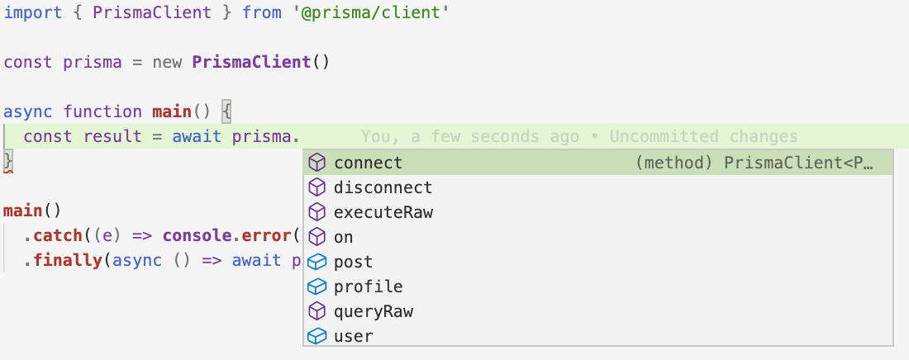

# Add queries for kudos data

## Goal

The goal lesson will be to put the newly completed data model to use and allow users to send and search for `Kudos` in your application. You will jump into building some more complex queries that involve managing relational data.

## Setup

You will continue working in the project you worked on in lesson one. Make sure your development server is up and running. If it isn’t run the following command within your project to start it up:

`npm run dev`

## Hints

- ***Type yourself*, don't copy and paste**
    
    To learn and really *understand* what you are doing for each task, be sure to **not copy and paste the solution** but type out the solution yourself (even if you have to look it up). 
    
- **Use the autocompletion**
    
    Prisma Client provides a number of queries that you can send to your database using its API. You can learn about these queries in the [documentation](https://www.prisma.io/docs/reference/tools-and-interfaces/prisma-client) or explore the API right in your editor using *autocompletion*.
    
    To invoke the autocompletion, you can open `src/index.ts` and type following *inside* of the `main` function (you can delete the comment `// ... your Prisma Client queries will go here` that's currently there):
    
    ```tsx
    import { PrismaClient } from '@prisma/client'
    
    const prisma = new PrismaClient()
    
    async function main() {
      const result = await **prisma.** // autocompletion will show up if you type this
    }
    
    main()
      .catch((e) => console.error(e))
      .finally(async () => await prisma.$disconnect())
    ```
    
    - Expand for a screenshot of the autocompletion
        
        
        
    
    Once you typed the line `const result = await prisma.` ****into your editor, a little popup will be shown that lets you select the options for composing a query (e.g.  selecting a *model* you want to query or using another top-level function like `$queryRaw` or `$connect`). Autocompletion is available for the *entire* query, including any arguments that you might want to provide!
    
- **Visualize data in Prisma Studio**

## Tasks

The functions for this set of tasks can be found in `app/utils/kudos.server.ts`

### Task 1: Finish the `createKudo` function

This function is being provided all of the data needed to create a new `Kudo`. Write a query to create a new document in the database, and be sure to connect the `author` and `recipient` users.

Be sure to properly type the `style` parameter using Prisma’s generated types for your embedded documents.

*This function is used in the “create kudo” form*

- Solution
    
    Import your instance of Prisma Client
    
    ```tsx
    import { prisma } from "~/utils/prisma.server";
    ```
    
    ```tsx
    import { KudoStyle } from "@prisma/client";
    
    export const createKudo = async (
      message: string,
      userId: string,
      recipientId: string,
      style: KudoStyle
    ) => {
      await prisma.kudo.create({
        data: {
          message,
          author: {
            connect: {
              id: userId,
            },
          },
          recipient: {
            connect: {
              id: recipientId,
            },
          },
          style,
        },
      });
    };
    ```
    

### Task 2: Finish the `getRecentKudos` function

On the main page of your application, there is a panel on the right side that will show the top three most recent kudos that were sent in your application by any user.

This function should return those three records. The only fields you need to return are:

- `style`
    - `emoji`
- `recipient`
    - `id`
    - `profile`
- Solution
    
    ```tsx
    export const getRecentKudos = async () => {
      return await prisma.kudo.findMany({
        take: 3,
        orderBy: {
          createdAt: "desc",
        },
        select: {
          style: {
            select: {
              emoji: true,
            },
          },
          recipient: {
            select: {
              id: true,
              profile: true,
            },
          },
        },
      });
    };
    ```
    

### Task 3: Finish the `getFilteredKudos` function

This function is a little bit more complex and requires you to craftily combine objects to build up your filtering and sorting options.  It should only return kudos received by the user associated with the `userId` passed as a parameter.

This function should return an array of kudos. It will only return these fields:

- `id`
- `style`
- `message`
- `author`
    - `profile`

The function is given these params:

- `userId`: The user whose kudos you are searching for
- `sortFilter`: An object that will be used to order the results of your query
- `whereFilter`: An object that will further filter your data

The `Prisma` namespace does provide types for the sort and where filter objects, so so be sure to use those.

*This function is used to display the user’s feed of kudos*

- Solution
    
    ```tsx
    import { KudoStyle, Prisma } from "@prisma/client";
    
    export const getFilteredKudos = async (
      userId: string,
      sortOptions: Prisma.KudoOrderByWithRelationInput,
      whereFilter: Prisma.KudoWhereInput
    ) => {
      return await prisma.kudo.findMany({
        select: {
          id: true,
          style: true,
          message: true,
          author: {
            select: {
              profile: true,
            },
          },
        },
        orderBy: sortOptions,
        where: {
          recipientId: userId,
          ...whereFilter,
        },
      });
    };
    ```